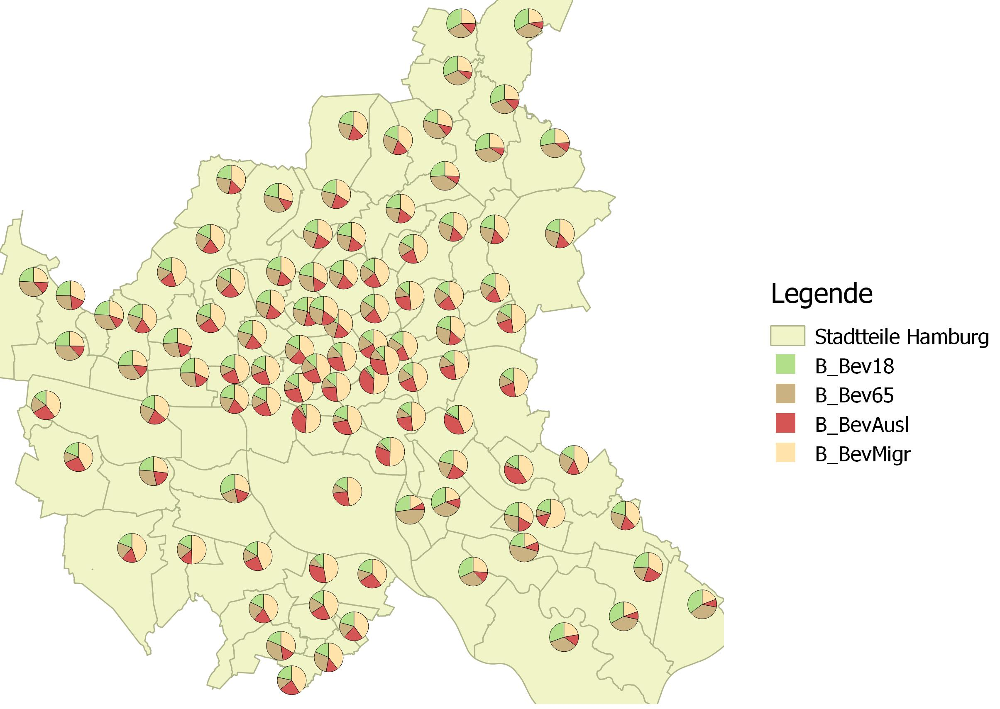
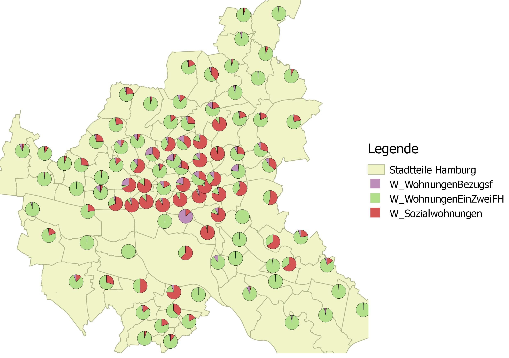
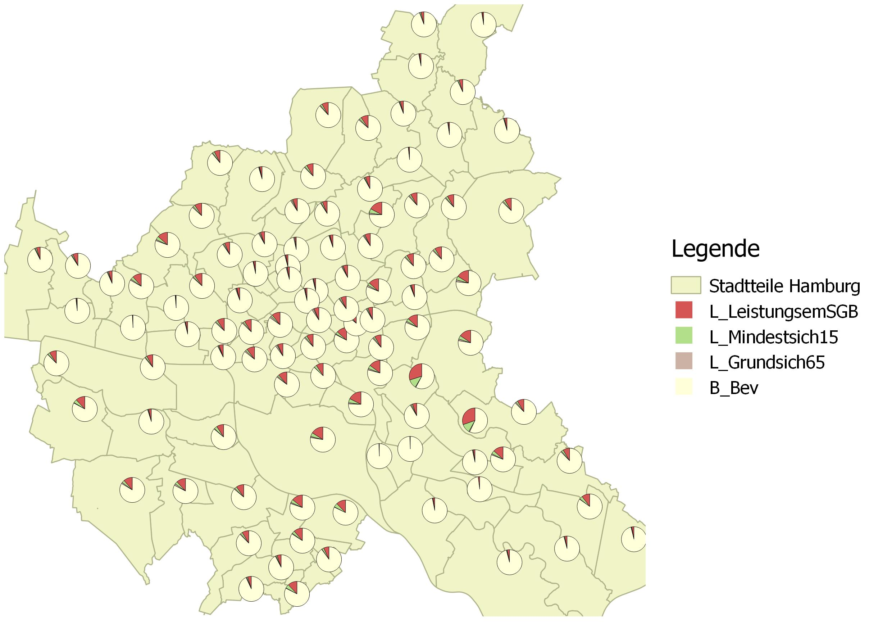
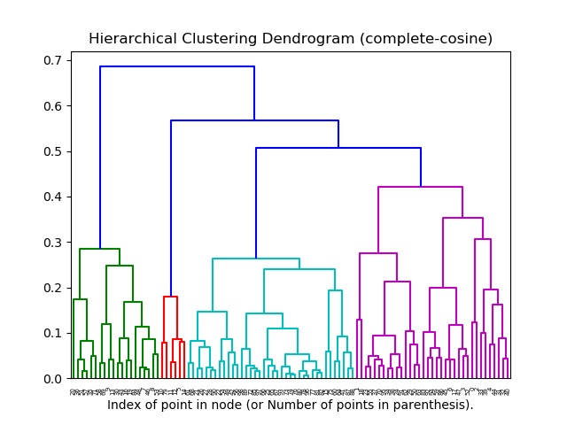
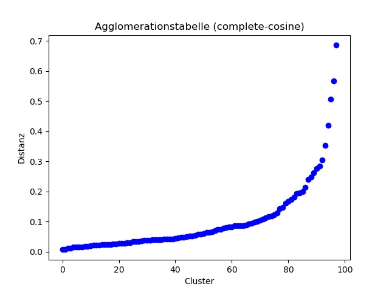
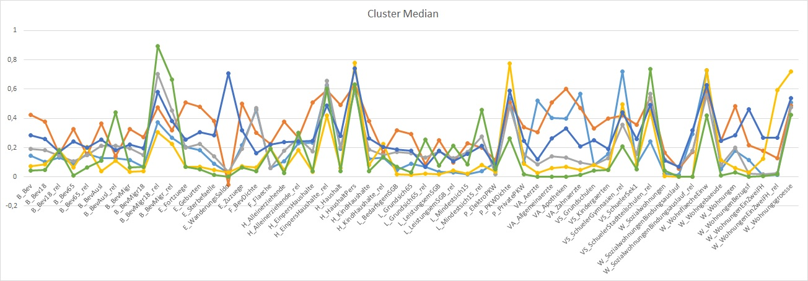
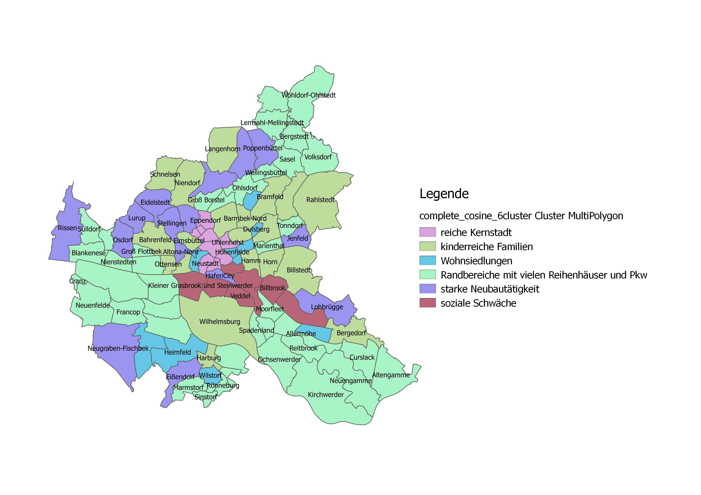

#

Systemanalyse
=============
Zunächst verschaffen wir uns einen ersten Überblick über die Daten. Hamburg hat 104 Stadtteile, die im Datensatz zu 99 Stadtteilen aggregiert worden sind. Des Weiteren enthalten die Stadtteilprofile 68 Attribute mit Werten zu: Bevölkerung, Haushalten, Arbeitslosen, Leistungsempfängern, Wohnungen, Schulen, Ärzten und PKW. Im Machine Learning sprechen wir von 99 Samples und 68 Features. Mit den Abbildungen 1 bis 3 erhalten wir schnell einen räumlichen Überblick über die Stadteile von Hamburg.


Abb. 1: Verhältnis von Bevölkerungsgruppen zueinander


Abb. 2: Verhältnis von Wohnungsarten zueinander


Abb. 3: Verhältnis von Leistungsempfängern zueinander

## Clusteranalyse
Beginnen wir mit dem Unsupervised Learning. Ziel der Clusteranalyse ist es, die Stadtteile in Klassen zu unterteilen, die in sich relativ homogen, untereinander aber möglich verschieden sind.
Der gesamte Quellcode des Kapitels ist in einem Jupyter Notebook [IPYNB-File](src/pub_2_clustering.ipynb) gespeichert. Zunächst importieren wir die benötigten Python packages.
```
import re
import numpy as np
import pandas as pd
import matplotlib.pyplot as plt
from scipy.cluster.hierarchy import dendrogram
from sklearn.cluster import AgglomerativeClustering
```
Jetzt lesen wir die Daten aus dem CSV-File in einen pandas DataFrame ein.
```
strSource = r"D:\ML\data\StadtteilprofileBerichtsjahr2018_org.csv"
df = pd.read_csv(strSource, sep=';', header=0, encoding='iso-8859-1')
```
Erzeugen eine neue Spalte ‚id‘, die wir im DataFrame zum neuen Index machen.
```
newIndex = []
for i in df.index:
    i += 1
    newIndex.append("ST" + str(i))

df['id'] = newIndex
df = df.set_index('id')
```
Bringen die 68 Features durch Normalisierung auf ein einheitliches Skalenniveau. Dazu bietet sklearn diverse Methoden, z.B. die Z-Transformation (StandardScaler). Da wir die Cluster später aber noch interpretieren müssen, schreiben wir unsere Normierungsroutinen selbst. Die Features mit Prozentwerten dividieren wir durch 100.
```
for key, value in df.iteritems():
    if re.search('_rel', key) != None:
        df.loc[:,[key]] = (df.loc[:,[key]] / 100.0).round(3)
```
Alle übrigen Features dividieren wir jeweils durch ihren Maximalwert.
```
for key, value in df.iteritems():
    if re.search('Stadtteil', key) != None:
        pass
    elif re.search('_rel', key) != None:
        pass
    else:
        maximum = df.loc[:,[key]].max()
        df.loc[:,[key]] = (df.loc[:,[key]] / maximum).round(3)
```
Der Datensatz enthält leider Samples, bei denen für einige Features keine Werte vorhanden sind. Davon betroffen sind alle Features mit Arbeitslosenzahlen sowie mit Grundstücks- und Wohnungspreisen. Es gibt verschiedene Strategien wie man mit diesen NaN-Values umgeht. Wir entfernen hier alle Features, bei denen NaN-Values auftreten. Damit verbleiben 55 Features für die Clusteranalyse.
```
df = df.dropna(axis='columns')
```
Jetzt kommen wir zur Clusteranalyse. Diese kann mit verschiedensten Methoden und Distanz- bzw. Ähnlichkeitsmaßen erfolgen und das Ergebnis wird immer verschieden sein. Wie suchen also experimentell nach dem Ansatz, der für uns zu den plausibelsten Clustern führt. Zu Clustern, die wir auch interpretieren können. Und wir suchen nach der optimalen Anzahl von Clustern. Dazu nutzen wir Agglomerationstabelle und Dendrogram. Für letzteres legen wir die Methode plot_dendrogram an, die wir aus einem sklearn [Beispiel](https://scikit-learn.org/stable/auto_examples/cluster/plot_agglomerative_dendrogram.html#sphx-glr-auto-examples-cluster-plot-agglomerative-dendrogram-py) übernehmen.
```
def plot_dendrogram(model, **kwargs):
    counts = np.zeros(model.children_.shape[0])
    n_samples = len(model.labels_)

    for i, merge in enumerate(model.children_):
        current_count = 0
        for child_idx in merge:
            if child_idx < n_samples:
                current_count += 1
            else:
                current_count += counts[child_idx - n_samples]
        counts[i] = current_count
    
    linkage_matrix = np.column_stack([model.children_, model.distances_,
                                      counts]).astype(float)
    
    dendrogram(linkage_matrix, **kwargs)
```
Wir entscheiden uns für eine Hierarchische Clusteranalyse mit dem Verfahren Complete Linkage und dem Kosinus als Ähnlichkeitsmaß.
```
methode='complete'; distanz='cosine'
dfc = df.loc[:,df.columns.difference(['Stadtteil'])]
model = AgglomerativeClustering(n_clusters=None, affinity=distanz, linkage=methode, distance_threshold=0)
model = model.fit(dfc)
```
Erzeugen uns die Agglomerationstabelle (vgl. Abb. 4) und das Dendrogram (vgl. Abb. 5).
```
#Dendrogram
plt.figure()
plt.title('Hierarchical Clustering Dendrogram '+ '(' + methode + '-' + distanz + ')')
plot_dendrogram(model, truncate_mode='level', p=10)
plt.xlabel("Index of point in node (or Number of points in parenthesis).")
    
#Agglomerationstabelle
plt.figure()
plt.title('Agglomerationstabelle ' + '(' + methode + '-' + distanz + ')')
plt.plot(model.distances_, "ob")
plt.xlabel('Cluster')
plt.ylabel('Distanz')
plt.show()
```
Die Agglomerationstabelle (vgl. Abb. 4) gibt uns jetzt den ersten Hinweis auf die optimale Anzahl der Cluster. Solange die Gerade homogen ansteigt, sind die Cluster, die miteinander fusioniert werden relativ ähnlich. Sobald die Gerade einen Sprung macht, werden zwei sehr unähnliche Cluster fusioniert. Wir sehen bei 12, 7 und 6 Clustern einen Sprung. Der deutlichste Sprung erfolgt bei der Fusionierung von 6 auf 5 Cluster. 6 Cluster scheinen also die optimale Wahl zu sein. Das überprüfen wir jetzt im Dendrogram (vgl. Abb. 5) und entscheiden uns endgültig für 6 Cluster.

Abb. 4: Agglomerationstabelle


Abb. 5: Dendrogram

Jetzt lassen wir die Clusteranalyse nochmals laufen, mit der Vorgabe von 6 Clustern, d.h. jeder der Stadtteile wird nun einem der 6 Cluster zugeordnet. Das Ergebnis hängen wir als neue Spalte 'Cluster' an den DataFrame.
```
clusterZahl=6
model = AgglomerativeClustering(n_clusters=clusterZahl,  affinity=distanz, linkage=methode, distance_threshold=None)
cluster = model.fit_predict(dfc)

dfc['Cluster'] = pd.Series(cluster, index=dfc.index)
```
In diesem DataFrame fehlt aber die Spalte 'Stadtteil'. Deshalb Mergen wir die neue Spalte 'Cluster' an den ursprünglichen DataFrame und Schreiben den fertigen DataFrame für weitere Auswertungen als CSV-File.
```
dfm = pd.merge(df, dfc.loc[:,['Cluster']], on='id')
dfm.to_csv(r"D:\ML\work\StadtteilprofileBerichtsjahr2018_cluster.csv", sep=';', na_rep='NaN', index=True)
```
Zum Abschluss in Python ermitteln wir jetzt noch für jeden Cluster die Median-Werte über alle Features, die in einem Liniendiagramm geplottet und ebenfalls als CSV-File geschrieben werden.
```
dfSeries = pd.DataFrame()
for i in range(model.n_clusters_):
    dfc_plot = dfc.loc[dfc['Cluster'] == i]
    dfc_plot = dfc_plot.loc[:,df.columns.difference(['Cluster','Stadtteil'])]
    s = dfc_plot.median().round(3)
    s.name = 'Cluster ' + str(i)
    s.plot.line()
    dfSeries = dfSeries.append(s)

filePath = "D:/ML/work/" + methode + "_" + distanz + "_" + str(clusterZahl) + ".csv"
dfSeries.to_csv(filePath, sep=';', na_rep='NaN', index=True)
 
plt.title('Cluster Median')
plt.xlabel('Variablen')
plt.ylabel('Value normiert (0-1)')
plt.legend()
plt.show()
```
Mit diesem CSV-File habe ich jetzt noch ein schöneres Excel-Diagramm (vgl. Abb. 6) erzeugt und interpretiert. Den Inhalt des ersten CSV-Files, das wir generierten, habe ich mit FME an die Polygon-Geometrien der Stadtteile angehängt und mit QGIS in einer Übersichtskarte der Cluster (vgl. Abb. 7) dargestellt. Das Ergebnis überzeugt mich allerdings nicht wirklich. Aber darum ging es hier ja auch nicht.

Abb. 6: Cluster Median


Abb. 7: Übersichtkarte Cluster
