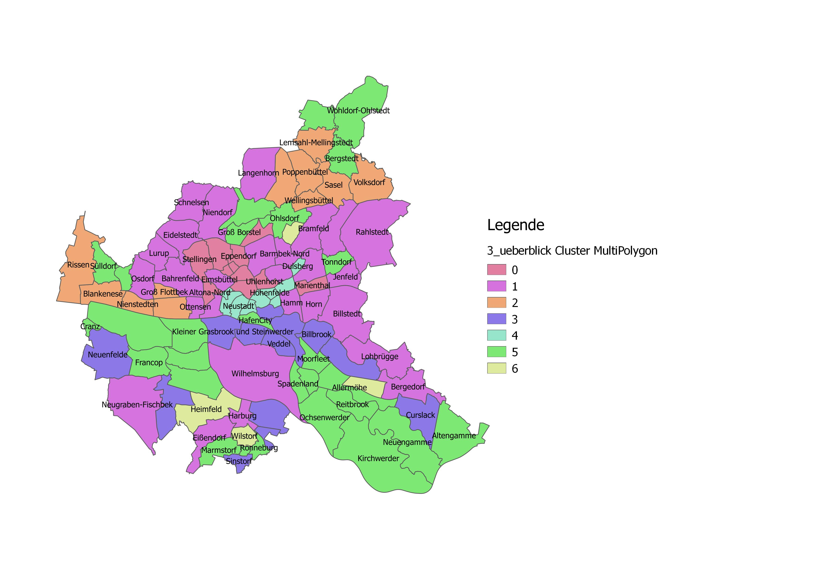

#

Systemidentifikation
====================
Bei der Systemidentifikation beschäftigen wir uns mit der Messung von Zusammenhängen zwischen den Features. Dies wird mittels Korrelationsanalyse bewerkstelligt, die wir hier aber nur indirekt anwenden werden.

## Hauptkomponentenanalyse
Mit der Hauptkomponentenanalyse wollen wir uns dem Fluch der Dimensionen widmen, d.h. wir wollen die  Dimensionen reduzieren. Die Hauptkomponentenanalyse versucht Informationen über die Korrelation von Features zu ihrer Bündelung zu verwenden.
Der gesamte Quellcode des Kapitels ist in einem Jupyter Notebook [IPYNB-File](src/pub_3_pca.ipynb) gespeichert. Zunächst importieren wir die benötigten Python packages.

```
import numpy as np
import pandas as pd
import matplotlib.pyplot as plt
from sklearn import preprocessing
from sklearn.decomposition import PCA
from sklearn.model_selection import cross_val_score
from scipy.cluster.hierarchy import dendrogram
from sklearn.cluster import AgglomerativeClustering
```
Dann lesen wir die Daten aus dem CSV-File in einen pandas DataFrame ein.
```
strSource = r"D:\ML\data\StadtteilprofileBerichtsjahr2018_org.csv"
df = pd.read_csv(strSource, sep=';', header=0, encoding='iso-8859-1')
```
Legen die Methode createIndex an, die eine neue Spalte 'id' als Index dem übergebenen DataFrame hinzufügt.
```
def createIndex(df):
    #Create Coumn ID and set as Index
    newIndex = []
    for i in df.index:
        i += 1
        newIndex.append("ST" + str(i))

    df['id'] = newIndex
    dfi = df.set_index('id')
    return dfi

df = createIndex(df)
```
Entfernen alle Features, die NaN-Values enthalten und normieren die Daten mit dem sklearn StandardScaler, d.h. wir führen eine Z-Transformation durch. Und um ggf. doch einen kleinen Blick auf die Korrelationen zu werfen, erzeugen wir uns eine Korrelationsmatrix und schreiben diese in ein CSV-File.
```
df = df.dropna(axis='columns')

scaler = preprocessing.StandardScaler()
array_scaled = scaler.fit_transform(df.loc[:,df.columns.difference(['Stadtteil'])])
dfs = pd.DataFrame(array_scaled,columns = df.columns.difference(['Stadtteil']))
dfs.cov().to_csv(r"D:\ML\work\Korrelationsmatrix.csv", sep=';', na_rep='NaN', index=True)
```
Und kommen jetzt zur Hauptkomponentenanalyse. Zunächst müssen wir ermitteln auf wie viele Dimensionen, d.h. Hauptkomponenten, unsere 55 Features reduziert werden sollen. Dazu initialisieren wie ein sklearn PCA-Objekt mit n_components=0.95, d.h. 95% der Varianz der ursprünglichen Features sollen erhalten bleiben. Mit diesen Einstellungen erfolgt eine Transformation zu 13 Hauptkomponenten, wobei die ersten 3 Hauptkomponenten 78% der Varianz erklären, die 4. Hauptkomponente nur noch 3% und die 13. Komponente lediglich 0,8%.
```
pca = PCA(n_components=0.95)
array_pc = pca.fit(dfs).transform(dfs)
print(pd.DataFrame(pca.explained_variance_ratio_))
print('Anzahl Hauptkomponenten: ' + str(pca.components_.shape[0]))
```
Jetzt ermitteln wir die cross-validation Scores bei einer schrittweisen Kumulation der Hauptkomponenten und stellen diese als Liniendiagramm dar.
```
pca_scores = []
for n in range(pca.components_.shape[0]):
    pca.n_components = n
    pca_scores.append(np.mean(cross_val_score(pca, dfs)))
    
plt.figure()
n_components = np.arange(0, pca.n_components+1, 1)
plt.plot(n_components, pca_scores, 'b', label='PCA scores')
plt.xlabel('nb of components')
plt.ylabel('CV scores')
plt.legend(loc='lower right')
plt.title('PCA-Scores')
plt.show()
```
Wir entscheiden uns letztendlich für die ersten 9 Hauptkomponenten und führen die Hauptkomponentenanalyse mit n_components=9 nochmals aus. Das Ergebnis mit 99 Samples und 9 Features können wir erneut in eine Clusteranalyse überführen.
```
pca = PCA(n_components=9)
array_pc = pca.fit(dfs).transform(dfs)
dfp = pd.DataFrame(array_pc)
dfp = createIndex(dfp)
```

## Wiederholung Clusteranalyse
Für die Clusteranalyse verwenden wir die gleichen Parameter wir im vorherigen Kapitel. Wir entscheiden uns diesmal allerdings für 7 Cluster. Das Ergebnis ist in Abb. 8 zu sehen. Die Interpretation und Überprüfung der Cluster habe ich hier nicht mehr durchgeführt. Darum geht es ja auch nicht.
```
def plot_dendrogram(model, **kwargs):
    # Create linkage matrix and then plot the dendrogram
    counts = np.zeros(model.children_.shape[0])
    n_samples = len(model.labels_)

    for i, merge in enumerate(model.children_):
        current_count = 0
        for child_idx in merge:
            if child_idx < n_samples:
                current_count += 1
            else:
                current_count += counts[child_idx - n_samples]
        counts[i] = current_count
    
    linkage_matrix = np.column_stack([model.children_, model.distances_,
                                      counts]).astype(float)
    
    dendrogram(linkage_matrix, **kwargs)
```
```
methode='complete'; distanz='cosine'
model = AgglomerativeClustering(n_clusters=None, affinity=distanz, linkage=methode, distance_threshold=0)
model = model.fit(dfp)

#Dendrogram
plt.figure()
plt.title('Hierarchical Clustering Dendrogram '+ '(' + methode + '-' + distanz + ')')
plot_dendrogram(model, truncate_mode='level', p=10)
plt.xlabel("Index of point in node (or Number of points in parenthesis).")
    
#Agglomerationstabelle
plt.figure()
plt.title('Agglomerationstabelle ' + '(' + methode + '-' + distanz + ')')
plt.plot(model.distances_, "ob")
plt.xlabel('Cluster')
plt.ylabel('Distanz')
plt.show()
```
```
clusterZahl=7
model = AgglomerativeClustering(n_clusters=clusterZahl,  affinity=distanz, linkage=methode, distance_threshold=None)
cluster = model.fit_predict(dfp)
dfp['Cluster'] = pd.Series(cluster, index=dfp.index)

dfm = pd.merge(dfp, df.loc[:,['Stadtteil']], on='id')
dfm.to_csv(r"D:\ML\work\pca_StadtteilprofileBerichtsjahr2018_cluster.csv", sep=';', na_rep='NaN', index=True)

dfSeries = pd.DataFrame()
for i in range(model.n_clusters_):
    dfm_plot = dfm.loc[dfp['Cluster'] == i]
    dfm_plot = dfm_plot.loc[:,dfm.columns.difference(['Cluster','Stadtteil'])]
    s = dfm_plot.median().round(3)
    s.name = 'Cluster ' + str(i)
    s.plot.line()
    dfSeries = dfSeries.append(s)

filePath = "D:/ML/work/" + methode + "_" + distanz + "_" + str(clusterZahl) + ".csv"
dfSeries.to_csv(filePath, sep=';', na_rep='NaN', index=True)
 
plt.title('Cluster Median')
plt.xlabel('Variablen')
plt.ylabel('Value normiert (0-1)')
plt.legend()
plt.show()
```


Abb. 8: Übersichtkarte Cluster
